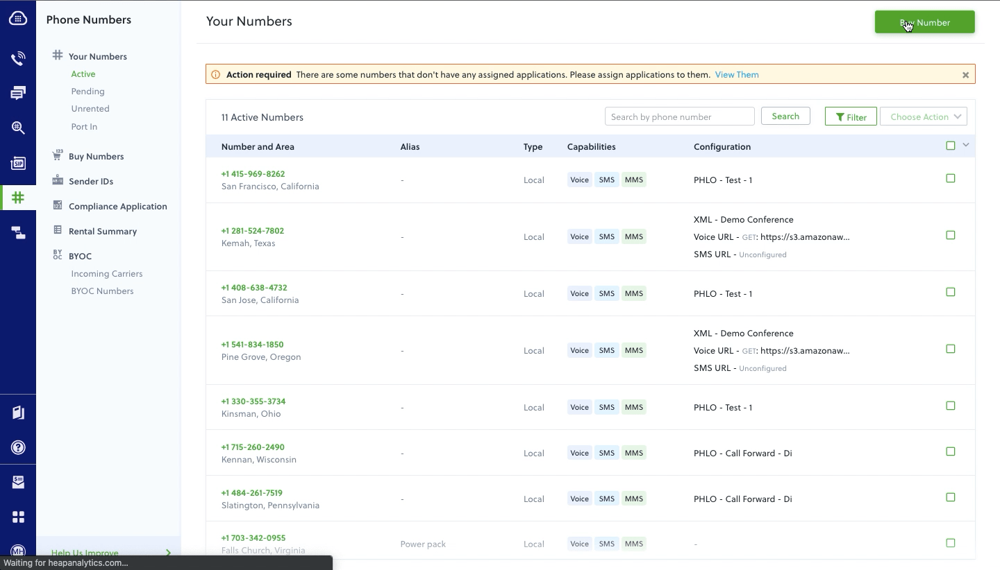
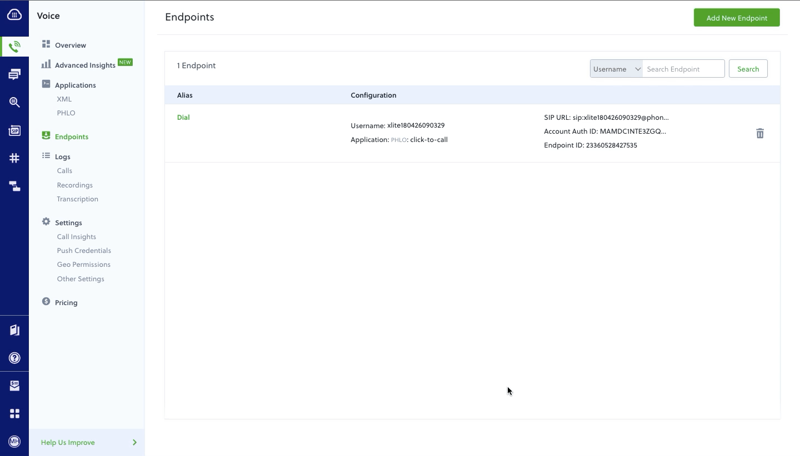

# Plivo webRTC phone
Simple softphone made with Plivo's webRTC browser SDK. Calls can be made to PSTN numbers and SIP addresses.

Two ways to make a call

* Call via the browser (uses <a href="http://opus-codec.org/" target="_blank">OPUS Codec</a>)
* Click-to-call
     User enters their phone number in the settings. When a call is placed, the user's handset will be called first and then the call will be connected to the destination #


## Application setup

Some initial setup is required before using this application (< 10 minutes). Let's get started!

1. Register for a Plivo account here <a href="https://console.plivo.com/accounts/register/">https://console.plivo.com/accounts/register/</a>

2. Purchase a new Plivo phone number from your [Plivo console](https://console.plivo.com/active-phone-numbers/).
  

3. Make an `XML` application to handle Browser calls.
   
   * Don't worry, we've already taken care of building an XML app for you; all you have to do now is create a new application on the [Plivo console](https://console.plivo.com/voice/applications/) and edit the below details.
   Set the `answer url` to `http://plivodirectdial.herokuapp.com/response/sip/route/?DialMusic=real&CLID=<caller id>` and method as `GET`.

        _NOTE_: At the end of answer_url, there is a place holder `<caller_id>`, replace it with the Plivo phone number that you've purchased.

    

4. Create a new [Plivo endpoint](https://console.plivo.com/voice/endpoints/) and assign it to the application created in Step 3. (_Note: your endpoint username and password will be used for signing in_)

    

5. Create a `PHLO`. This will handle all of the call logic behind the scenes once a call is initiated for click to call and assign it to the number purchased in *step 2*.

    ### Creating a PHLO
    PHLO stands for Plivo High Level Objects. This product was built with the goal of reducing Voice and SMS application development time from weeks to minutes. The drag & drop UI allows both developers and non-technical people to quickly build and test apps without writing any code or managing a server. _In the future this product will have full parity with our developer APIs._

    

    ### How this PHLO works:

    Every PHLO begins with a _start node_ that can be triggered by an HTTP request or an incoming call (incoming SMS if it is an SMS PHLO). Since our phone can make calls in more than one way, we'll utilize both trigger events here.

    Now for the click-to-call. This is is a slightly more complicated use case because it requires us to actually send an HTTP request with a payload to our PHLO endpoint. Remember that we will be making a call to our user's handset first, and then connecting to the destination once the first call is answered. We'll need to get both phone numbers from our application and send it to our server. Our code should look something like this:

    ```
    let XMLReq = new XMLHttpRequest();
    XMLReq.open("POST", "/makeCall");
    XMLReq.setRequestHeader("Content-Type", "application/json");
    XMLReq.onreadystatechange = function() {
        console.log('response text', XMLReq.responseText);
    }
    XMLReq.send(JSON.stringify({"src": this.state.phoneMeNumber, "dst": dest}));
    ```

    We'll need to listen for this request on our server. Once we receive this request and get the numbers from the payload, we will set up another HTTP request that sends this data to our PHLO. Here's our code: 

    ```
    // when we receive an http post request
    app.post('/makeCall/', function(req, res) {
      console.log(req.fields);

      jsonObject = JSON.stringify({
          "phoneMeNumber"     : req.fields.src,
          "destinationNumber" : req.fields.dst,
      });

      // prepare the header
      let postHeaders = {
        'Content-Type' : 'application/json',
        'Authorization': 'Basic ' + new Buffer.from(process.env.PLIVO_AUTH_ID + ':' + process.env.PLIVO_AUTH_TOKEN).toString('base64')
      };

      // set the post options
      let postOptions = {
        port   : 443,
        host   : 'phlo-runner-service.plivo.com',
        path   : '/account/MAXXXXXXX/phlo/ccccXXXXXXXXXXXXXXXXX', // our PHLO URL
        method : 'POST',
        headers: postHeaders,
      };

      // do the POST request
      let reqPost = https.request(postOptions, function(response) {
        console.log("statusCode: ", response.statusCode);
        response.on('data', function(d) {
          console.info('POST result:\n');
          process.stdout.write(d);
          console.info('\n\nPOST completed');
          res.send(d);
        });
      });

      // write the json data
      console.log(jsonObject);
      reqPost.write(jsonObject);
      reqPost.end();
      reqPost.on('error', function(e) {  // log any errors
        console.error(e);
      });
    })
    ```

## Deploying the application
```
git clone https://github.com/seanmiller802/webRTC-phone.git

cd webRTC-phone
```

### Setting up your app

* open `.env` folder and replace the place holders `<auth_id>` and `<auth_token>` with the values available in your [Plivo dasboard](https://console.plivo.com/dashboard/)

```
PLIVO_AUTH_ID="<auth_id>"
PLIVO_AUTH_TOKEN="<auth_token>"
```

* update the PHLO URL under `server/index.js`, under the 
below piece of code, replace the parameter `path` with the [PHLO URL](https://console.plivo.com/phlo/list/).
```
let postOptions = {
      port   : 443,
      host   : 'phlo-runner-service.plivo.com',
      path   : 'https://phlorunner.plivo.com/v1/account/MAXXXXXXXXXXXX/phlo/4XXXXXXXXXXXX', // our PHLO endpoint'
      method : 'POST',
      headers: postHeaders,
    };
```

## Execute the below commands to run your app
```
npm install

npm run watch

npm run start
```
## Features

* Make calls (Browser, Click-to-call)
* Receive calls
* Log calls
* Live call quality metrics (displayed in real time during network events during the call)
* Send feedback to Plivo

## Built With

* [React](https://reactjs.org/) - Javascript framework for building UIs
* [Material-UI](https://material-ui.com/) - React components that implement Google's material design standards
* [Plivo](https://www.plivo.com/) - Making and receiving calls
## License

This project is licensed under the MIT License - see the [LICENSE.txt](LICENSE.txt) file for details


